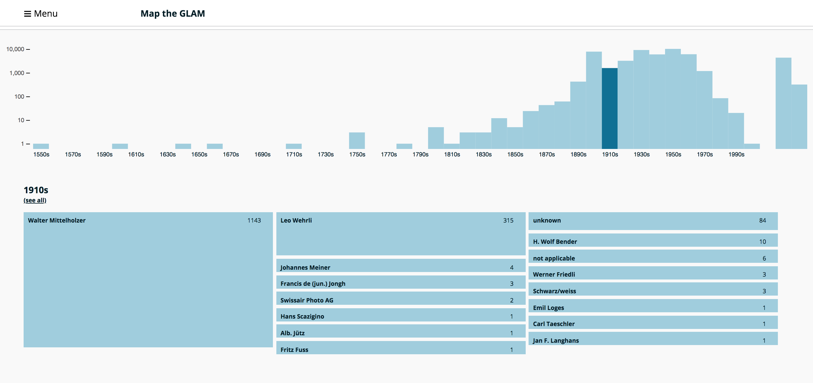
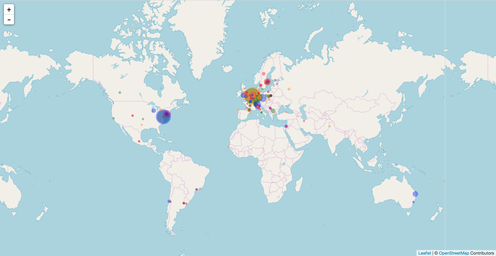

# Map the GLAM
Map the GLAM is part of a PhD thesis focusing on the interface characteristics that may foster the access and use of digital images released under open licenses by Galleries, Libraries, Archives and Museums (GLAMs).
In particular, Map the GLAM visualises the digital images uploaded by [ETH Bibliothek](https://commons.wikimedia.org/wiki/Category:Media_contributed_by_the_ETH-Bibliothek) to Wikimedia Commons.


## Visual interface


*Visual filter*


*GLAMs in the world*


## Installation
1. Go to the project folder in your computer
	```
	$ cd < path_to_the_folder >
	```
2. Install the bower dependencies
	```
	$ bower install
	```
3. Run local server 
	```
	$ python -m SimpleHTTPServer 8000
	```
4. Access the webpage at
	```
	http:localhost:8000 < path_to_the_folder >
	```

## This project uses:
-	[Bower](https://bower.io/)
-	[Neat](http://neat.bourbon.io/)
-	[jQuery](https://jquery.com/)
-	[D3](https://d3js.org/)
-	[Handlebars](http://handlebarsjs.com/)
-	[Isotope](https://isotope.metafizzy.co/)

### Bower (install and update packages)
-	cd < path_to_the_folder >
-	bower install < package_name >
-	bower update

### Neat 
- 	update the sass file
-	build the css (cmd + B, on Sublime Text)